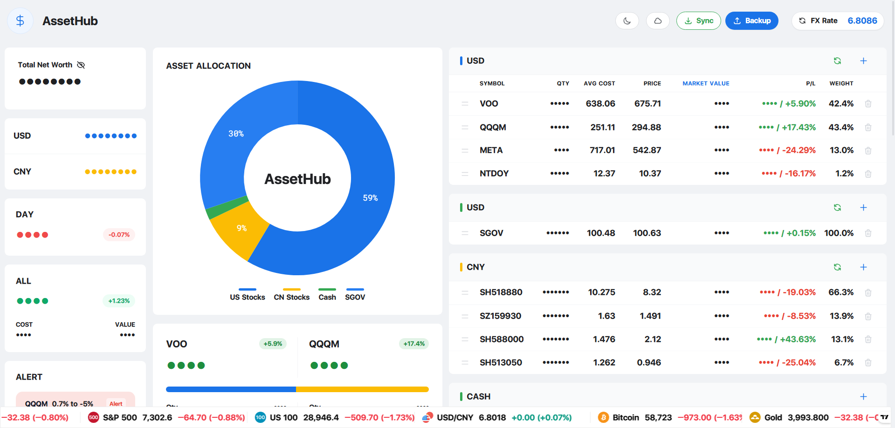
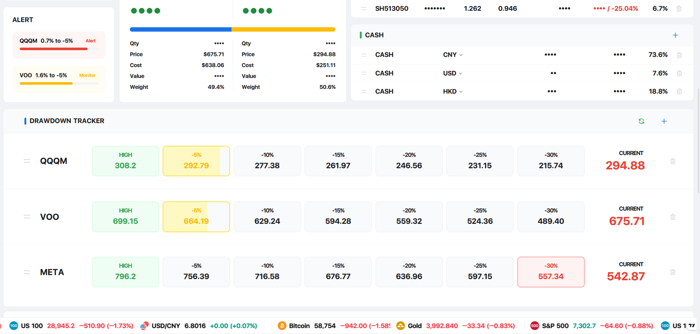

# AssetHub

AssetHub 是一个个人资产管理仪表盘，用原生 HTML、CSS 和 JavaScript 开发，不依赖复杂前端框架。它主要用于记录和查看个人投资组合，包括美股、A 股、现金、SGOV 类现金资产，以及 VOO/QQQM 回撤监控。

项目适合直接部署在 GitHub Pages 上，也可以本地打开 `index.html` 使用。

## 主要功能

- 资产总览：显示总资产、美元资产、人民币资产、现金和持仓占比
- 持仓管理：支持美股、A 股、SGOV、现金资产的新增、编辑、删除和拖拽排序
- 自动计算：自动计算市值、成本、盈亏、占比、总资产
- 汇率换算：支持 USD/CNY、HKD/CNY 汇率换算
- 图表展示：资产配置环形图、净值曲线、年度/月度盈亏日历
- 回撤监控：跟踪 VOO、QQQM 等标的距离 5%、10%、15%、20%、25%、30% 回撤档位的距离
- 隐私模式：一键隐藏敏感金额
- 深色模式：支持亮色/暗色主题切换
- GitHub 同步：可通过 GitHub API 把数据备份到 `data.json`
- 行情更新：支持通过外部接口刷新股票价格和汇率




## 项目结构

```text
AssetHub/
├─ index.html                 # 页面结构
├─ css/
│  └─ app.css                 # 页面样式
├─ js/
│  ├─ app.js                  # 主要功能逻辑
│  └─ tailwind.config.js      # Tailwind 配置
├─ data.json                  # 云端同步数据
├─ logo.png                   # 网页图标
├─ apple-touch-icon3.png      # 移动端收藏图标
└─ README.md
